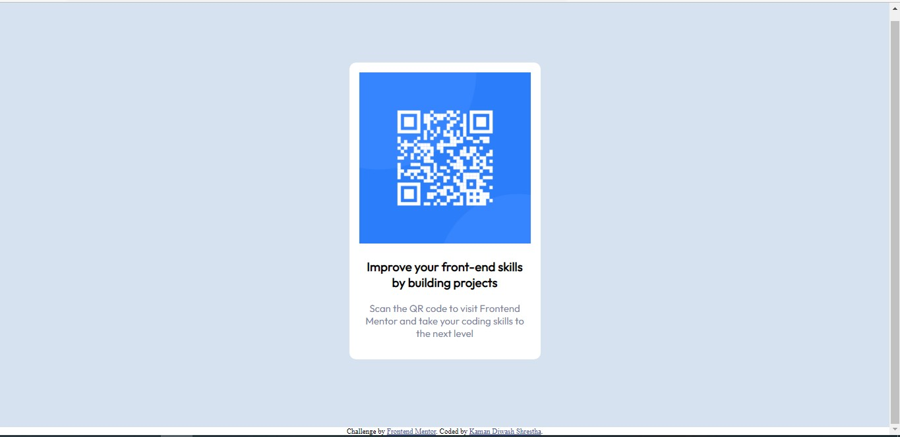

# Frontend Mentor - QR code component solution

This is a solution to the [QR code component challenge on Frontend Mentor](https://www.frontendmentor.io/challenges/qr-code-component-iux_sIO_H). Frontend Mentor challenges help you improve your coding skills by building realistic projects. 

## Table of contents

- [Overview](#overview)
  - [Screenshot](#screenshot)
  - [Links](#links)
- [My process](#my-process)
  - [Built with](#built-with)
  - [What I learned](#what-i-learned)
  - [Continued development](#continued-development)
  - [Useful resources](#useful-resources)
- [Author](#author)
- [Acknowledgments](#acknowledgments)

## Overview
  This is the solution for the QR Code challenge from [frontendmentor](https://www.frontendmentor.io/challenges/qr-code-component-iux_sIO_H/hub/qr-code-component--cOHpIvbt4/edit). Using HTML and CSS, this challenge has been completed. Using HTML to structure the page and CSS especially flex to style the page, the webpage has been made.
### Screenshot




### Links

- Solution URL: [GitHub repository](https://github.com/FrontEnd-Development-Learning/QR-Code-)
- Live Site URL: [Live Site](https://frontend-development-learning.github.io/QR-Code-/)

## My process
  I started out using HTML to structure all the elements and contents of the page. Using div tag, I enclosed all the contents of the page for further styling. Using h3 tag and p tag, the text content of the page is denoted and structured. Afterwards using CSS flex, I centered the main content and using different color properties, text and background is coloured. The image of image and overall content is styled using CSS with pixel measurement.

### Built with
- Semantic HTML5 markup
- CSS custom properties
- Flexbox


### What I learned
  I learnt about the use of CSS to center the content in the page. 
  ```css
.mainContent {
  display: flex;
  /* aligning the item along the cross axis of flex container */
  align-items: center;  
  
  /* aligning the item along the main axis of flex container */
  justify-content: center;
}
```

I also learnt about using CSS to make the height of whole body/div to the size of the screen
```css
.html body{
  height: 100%
}
```

I also learnt that text content inside the div tag would be indented according to the size of the div if specified. Otherwise, the div would take as whole content along with obligating the next element to be from the next line as it is the block element. 


### Continued development
Regarding making a responsive webpage, I have to research more on the way of doing that by building projects and learning about fluid grids. Implementing the responsiveness of the webpage would be the main learning objective for me while builidng the website. 

### Useful resources

- [Centering using CSS](https://moderncss.dev/resource-the-complete-guide-to-centering-in-css/) - This helped me for centering the content. I really liked this pattern and will use it going forward.


## Author

- Website - [Kaman Diwash Shrestha](https://github.com/KamanDShrestha)
- Frontend Mentor - [@KamanDShrestha](https://www.frontendmentor.io/profile/yourusername)
